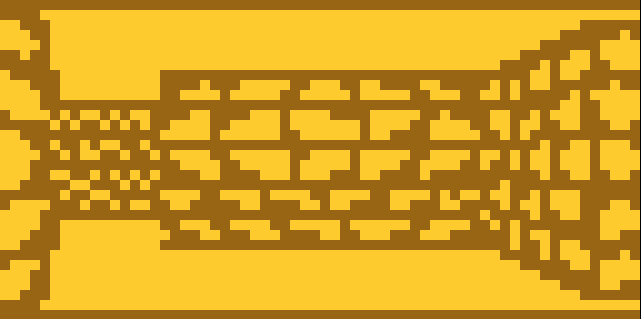
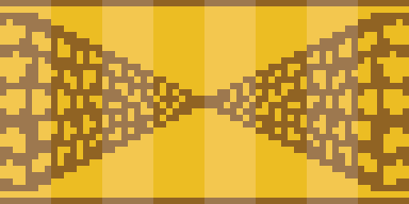
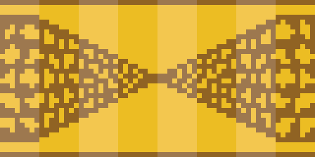
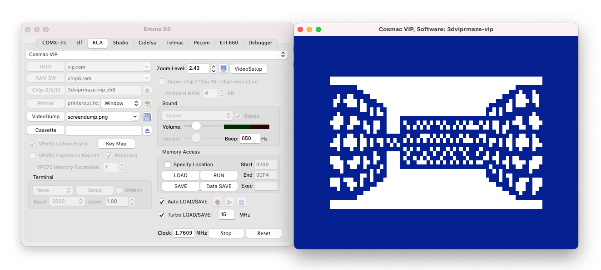

# 3D VIP'r Maze



A watered down version of [3D Viper
Maze](https://github.com/Timendus/3d-viper-maze), my [Octojam
7](https://itch.io/jam/octojam-7) submission. Challenge: reduce the instruction
set, speed requirements and overall program size to make it run on "standard"
Chip-8 interpreters. And preferably the original hardware from the time period
too.

* [Play the game in your browser](https://timendus.github.io/3d-vipr-maze/)
* [Download binaries](https://github.com/Timendus/3d-vipr-maze/tree/main/bin)

## The concept

3D VIP'r Maze is (obviously) an homage to the Sinclair ZX81 game 3D Monster Maze
from 1981. That game was released just three years after the specification for
Chip-8 was published, so it's from around the same era. In honour of the first
computer that ran Chip-8, the Cosmac VIP, and its related magazine, the VIPer, I
figured it was time for a viper version of 3D Monster Maze, and I created [3D
Viper Maze](https://github.com/Timendus/3d-viper-maze) for [Octojam
7](https://itch.io/jam/octojam-7).

The intention I had with 3D Viper Maze, although written using XO-Chip instructions to make it more fun as a game, was always to create a version of the game that
can run on the original Cosmac VIP Chip-8 interpreter. This version became 3D
VIP'r Maze, and that is what you're looking at.

3D VIP'r Maze is a game with an endless supply of randomly generated mazes, just
like its namesake. Your challenge, if you accept it: to find the exit in each
maze! How far can you get?

## Development notes

### Beginning is easy

You just take the instructions that are in XO-Chip, but not in regular Chip-8,
and get to work removing those instructions. For this game that meant first and
foremost to remove all the code and data that has anything to do with sound and
colour.

Throwing out the sound was easy enough; the code was mostly in a single file
with relatively few calls to it. The sound data was also in a single file.
Bye bye... 🎶

Colour was slightly more difficult. It's not enough to just remove all the
`plane` instructions from the program; the image to binary data scripts also
needed to change, so they wouldn't load the extra plane of image data anymore.
While I was working on those scripts I also made them cut the images up in 8x8
sprites instead of 16x16, so we can more easily address the different parts of
the images. Regular Chip-8 doesn't have a way to render 16x16 sprites, as
XO-Chip does.

So the next challenge was to adapt the rendering code to render 8 pixel wide
columns. I kinda forgot that we can render 8xN sprites in Chip-8, where N is a
nibble (0-15). That's a very handy thing to have. The larger the number of
pixels that we can render in one go, the faster the rendering will be. According
to Wikipedia Chip-8 will render a height of N+1 pixels (allowing 16 vertical
pixels), but Octo doesn't seem to think so (and sticks with 15 pixels). But 15
is fine too. We can live with missing the top and bottoms rows from our rendered
image, if that speeds rendering up by a factor of two!

The next things to go were the "drop dead" animation (which used `scroll-up`)
and the text routines. The font was pretty large and the text rendering way too
slow for Chip-8. So that had to go.

Finally, I threw out all the things that weren't gameplay related, like the
title screens, introduction screens and end-of-game screen. Those just take up
space and don't add so much to the game experience.

### For good measure

Those last few steps were also because I knew that the original game was waaay
to large to fit in the miserably small memory size of Chip-8. I needed to cut
away as much as possible to lose some dead weight, otherwise this was never
going to work. Because the last and hardest XO-Chip instruction I needed to
remove was `i := long NNNN`...

We need to go from 16 bits addresses back to 12 bit addresses. Not just the game
code, but the **whole game** now needs to fit within the magic 3.5K limit. I
wondered where I stood with this endeavour, seeing as I had already halved the
number of bytes in the image data going from four to two colours, and thrown out
quite a few bytes left and right. So I made a rough overview of which data was
where in memory.

The result wasn't very promising.

|  Address space  | Size | Contents                    |
|-----------------|------|-----------------------------|
| `$0000 - $0200` |  512 | Interpreter code            |
| `$0200 - $0B70` | 2416 | Game code                   |
| `$0B70 - $2700` | 7056 | Tiles, screens, binary tree |
| `$2700 - $29A8` |  680 | Map data and game state     |

Even without the text and music code, my program code size alone was nearing the
3.5K limit 😮

So the code needed to go on a diet first. We can add compression to the image
data, or reduce the resolution, or maybe reuse sprites. We can reduce the number
of game levels. But we can't wish away real program code. The next step I took
was to investigate where exactly all this game code "lives". I wrote a script to
roughly measure the size of each of my source code files.

Roughly speaking, each line of code in Chip-8 is two bytes, give or take. So my
script just iterates over all files, throws out comments and empty lines and
does the remaining line count times two. It's by no means perfect and it seems
to under-estimate the sizes, but it's a good enough estimate for now.

These were the results:

```
Rough size estimation:
  218  ./src/key-input.8o
  56   ./src/main.8o
  130  ./src/map-management.8o
  372  ./src/map-triggers.8o
  136  ./src/mini-map.8o
  224  ./src/render-3d.8o
  348  ./src/transitions.8o
  252  ./src/viper-ai.8o
```

We can't lose the key input, the main file, the map management or the 3D
rendering code (unless we make this into a completely different game). We can
however simplify the map triggers, and choose to throw out the mini map and
either throw out or greatly simplify the vipers. Maybe the buttons or the coins
need to go, maybe the mini map, maybe the vipers, maybe just the viper
animations. Or maybe all of them.

So far I hadn't really thrown anything out that significantly changed the
gameplay. But any of these choices would definitely do that, and reduce the fun,
the interactivity, the stuff that makes the game worth playing.

### Back to the drawing board

So needless to say, I'm not a happy coder at this point 😂

Maybe I just needed to go back to the start, and instead of trying to reduce a
complete game with all these bells and whistles, try to get the 3D rendering
stuff to run on Chip-8 first. And then see what we can add, if anything. That
may reduce the whole exercise to a tech demo instead of a game, but that's okay
too.

```
Rough size estimation:
  172  ./src/key-input.8o
   38  ./src/main.8o
  130  ./src/map-management.8o
  148  ./src/render-3d.8o
------------------------------- +
  488 bytes
```

So I proceeded to strip everything out except for rendering and player movement.
After the first rough pass I reduced the code size down to 580 bytes and I left
in just a single map and the game state, which comes in at 146 bytes. That's
quite reasonable. But the screen data and the decision tree still accounted for
almost 6000 bytes. After removing the top and bottom rows from the screen data
(since we're not rendering those anyway) I ended with 5324 bytes of data.

So where does this leave us?

|  Address space  | Size | Contents                |
|-----------------|------|-------------------------|
| `$0000 - $0200` |  512 | Interpreter code        |
| `$0200 - $0444` |  580 | Game code               |
| `$0444 - $1910` | 5324 | Screens, binary tree    |
| `$1910 - $1A56` |  146 | Map data and game state |

Our memory map should end at the most at `$FFF`, but preferably at `$E90`. So
we're at least ~2650 bytes over budget. Could we halve the screen data and
decision tree size to ~2670 bytes? Would that be a reasonable thing to expect?

The answer is a solid _maybe_ 😉. Writing a couple more scripts to dissect the
data segments of our memory map revealed that 90% of it was screen bitmaps:

```
4920 bytes in screens.txt     -  90%
 404 bytes in binary-tree.8o  -   7%
   6 bytes in game-state.8o   -  <1%
 128 bytes in maps.8o         -   2%
----------------------------- +
5458 bytes
```

_(Note for the accurate people among us: I've removed a couple of bytes from the
game state in between these two tests, which is why this total is 12 bytes short
of the addition of the two sizes above.)_

This was actually good news for two reasons:

1. We can compress image data, and/or use a smaller portion of the display,
reducing the resolution and thus the amount of image data.

2. Having reduced our colour palette (and maybe the resolution too), the amount
of detail that is visible in the distance is greatly reduced. We can probably
strip out one or two levels of depth that we can't see anyway, and drop a lot of
bytes.

### Squeezing bytes

Alright, so on to that first point. We needed to shave ~2650 bytes off our 4920
bytes of screen data. That comes down to needing a compression ratio of 46%. If
we could hit that, we'd have liftoff!

But decompressing image data isn't for free. It takes space in the sense of
needing to have a decompression algorithm and some data buffer to decompress
into and it takes a lot of CPU cycles to do the actual decompression. Neither of
which we have a lot of. So the first challenge is to write a decompression
algorithm that isn't too depressingly slow and isn't overly huge.

So I started work on a simple run length encoding scheme. Use a bit to encode if
we're in plain copy or run length mode, use the other seven bits to encode for
how many bytes that goes, and the byte(s) that follow are the image data.

```
# Run length mode, eight times 0xff:
0x08 0xff

# Plain copy mode, for four bytes:
0x84 0x77 0x0A 0x00 0x80
```

Worst case scenario this adds one byte per run, best case scenario this reduces
an entire run to two bytes. And a run can be a maximum of 127 bytes, although we
will never hit that theoretical maximum. Note that runs of two or three bytes
will make no sense with this encoding scheme. Replacing two identical bytes with
one byte indicating a run of two and the next byte indicating what to be
repeated makes no sense, and has the downside of breaking up the plain copy run.
So we have to restart that too, taking up one **more** byte than if we just left
the two bytes in the copy run. For three bytes it doesn't really make any
difference, more on that later.

So the question then becomes: how many runs, of which types and which lengths do
we have?

#### Side note

Okay, so a little side-note about writing decompression algorithms for Chip-8 is
in order, I think. Chip-8 has only one 16-bit index register, so you can only
point to one place at a time. As you'll understand, this is a problem when
you're trying to write a subroutine of any kind that can move or manipulate data
from one place to another.

The general solution to this issue is to "unpack" your addresses in registers
and then use self-modifying code to load the addresses into the only available
16-bit register when needed. To make matters more complicated, the first couple
of registers are at a premium because we can only read from and write to memory
(including the SMC trick) using the first couple of registers. So all in all,
just copying one byte from one supplied address to another would look something
like this madness:

```
: main
  # pretend we have this macro: (which adds code too, btw)
  unpack-to v6, v7, compressed-data
  unpack-to v8, v9, destination-buffer
  decompress
  # End

: decompress
  v0 := v6
  v1 := v7
  v2 := $A0
  v0 |= v2
  i := decompress-smc1
  save v1
: decompress-smc1
  0 0
  load v0
  v5 := v0
  v0 := v8
  v1 := v9
  v0 |= v2
  i := decompress-smc2
  save v1
: decompress-smc2
  0 0
  v0 := v5
  save v0
  return
```

This code hasn't been tested, and it's probably wrong, but you get the idea 😉
We can't be doing something like this for each and every byte we need to draw to
the screen, because it would be way too slow.

So I thought to myself: if we decompress as many bytes as we can from a given
memory location to _registers_ first, we can then write those bytes to the
destination buffer in one go. This would speed up the decompression step because
we're not constantly switching between pointers. My first implementation allowed
for a maximum of 11 bytes to be decompressed before we ran out of registers.
Also, because the first couple of registers do the heavy lifting, this required
me to store the compressed data segments in reverse. So not really an optimal
solution, but the concept was a good start. However, I needed to be able to
decompress more than 11 bytes.

So I wrote a second implementation, that loads the source address from memory
using the SMC trick once per "run". It then loads the entire run into registers
and writes the run back to memory in one go. I was able to save one more
register, so this means that this time a run can be no longer than 12 bytes. But
there is no more limit on the length of the entire data segment, so that's a
bonus.

Another optimisation that I found was to not load the destination address from
memory, but to use a fixed buffer location, and use a register to point to the
current byte in that buffer. This limits the length of our decompressed data to
255 bytes, but that's well within what we need.

These are nice optimisations, but still: decompression and Chip-8 weren't really
made for each other.

#### Back on track

Alright, so back to that question about what kind of runs we can get, and with
that: what our compression ratio is going to be.

After writing a compression script that also takes into account the 12 bytes run
length limit, and only compresses runs of three bytes or more, I ended up with a
compression ratio of around ~27%. Which is nice, but nowhere near our target of
46%.

Also, having to decompress our images turns out to be pretty slow. So as a minor
improvement I opted to compress runs of four bytes or more, to reduce the
average number of runs per image. This _should_ have no impact on the ratio in
an ideal world, but because we can only have runs of 12 bytes and the cut-offs
for the runs fall in different places, in practice it costs us one or two
percent of compression efficiency.

Alright, so we have 4920 bytes to compress, 25% of that is 1230 bytes. My
decompression algorithm is 326 bytes including the buffers, so we've just saved
ourselves ~900 bytes. Saving almost a kilobyte is impressive on this platform,
but it was nowhere near enough.

But I had a couple of other, compatible ideas to test.

### Those flippin' images

Half of our images is completely redundant. In 99% of cases, the images on the
left half of the screen are a flipped but otherwise identical version of the
images on the right. So if I could flip the images on the fly, that would save
us almost 50%! Talk about impressive compression ratios.

I considered this idea before in my original 3D Viper Maze, but thought it would
be way too slow in practice. So I opted (as I did in so many places) to
sacrifice some storage for speed. But now it was time to give it a try, to see
if we could sacrifice some speed for storage, and be happy with it.

[The algorithm](experiments/flip.8o) to flip the images was a lot easier to
write than the decompression algorithm, and it required no compression step. So
at first I thought: why didn't I try this idea first? It's so much simpler, more
effective and faster to build!

But the answer to that question was that my initial hunch was correct. Flipping
images is a per-bit operation. Decompressing them is a per-run-of-several-bytes
operation. On a platform as limited as Chip-8, this really matters:


_Images on the left are rendered from memory, images on the right are flipped
first. Running at 30 cycles/frame in Octo._


_Images on the left are rendered from memory, images on the right are
decompressed first. Running at 30 cycles/frame in Octo._

So while a great idea in theory, flipping images on the fly seems like a no-go.

### Duplicates

But there is yet another way to save a lot of bytes in the image data.

As I explained in my [development notes for 3D Viper
Maze](https://github.com/Timendus/3d-viper-maze#development-notes), I render
four 16 pixels wide columns for which I determine the right image using a
decision tree. This way the screen gets composited together with all the right
parts, and I don't need to have an image in memory for each and every possible
permutation of the map. As I hinted there, I could have a decision tree for each
column of 8 pixels instead.

The downside of that is obvious: we have to traverse twice as many decision
trees to render one screen, which will be more slow. We will also have more data
in the decision tree. The upside may not be so obvious: having 8 pixel wide
columns allows for more permutations in the composition step, reducing the
number of permutations of the images that we need. In many of the 16 pixel wide
images, either the left or the right side of the image is the same as some other
image.

So I set out to try this approach. It was quite a lot of work to rewrite the
image cutting and importing code, update the rendering code and most
importantly: redo the decision trees to have eight of them and filter out the
duplicate images. And while I was at it, I removed the images where there's a
hall to the left or right in the far distance, because the difference of a
single pixel was pretty much indistinguishable anyway. It was not much fun to
have to revisit these trees, and it made the game run a lot slower.

But the good news was that the 4920 bytes of uncompressed image data was now
reduced to only 3000 bytes. The decision tree grew a bit from 404 bytes to 624
bytes, but this was a net gain of 1700 bytes! Way more impressive than my
compression algorithms actually.

In fact, this step almost made the compression useless. The compressed size of
these images is now 2337 bytes, and after subtracting the 296 bytes of the
decompression algorithm (which shrunk: remember, we dropped 30 bytes of image
buffer too!) we're left with a net compression gain of just 367 bytes. So much
work for so little result 🙈😂.

But hey, this is Chip-8: every byte counts!

### The last mile

After all this shaving off bytes left and right in the image data and adding
code, let's take another look at that memory map:

|  Address space  | Size | Contents                |
|-----------------|------|-------------------------|
| `$0000 - $0200` |  512 | Interpreter code        |
| `$0200 - $056E` |  878 | Game code               |
| `$056E - $10FF` | 2961 | Screens, binary tree    |
| `$10FF - $1185` |  134 | Map data and game state |

So close! We're only 390 bytes over budget. Or 757 bytes to run it with the
original Cosmac VIP interpreter. But either way, this feels like we're almost
there! We've had to strip out absolutely everything that ever made it feel like
a fun and polished game and reduced it to a slow tech demo, but we are getting
pretty close now.

To get rid of the last few hundred bytes, I turned my attention to the code
again. I gave up on being able to switch maps (seeing as having a single map is
already proving to be a challenge) and I was able to optimize some of the key
input and map management code, which was some of the first Octo-flavoured Chip-8
code that I wrote. It turns out that I have learned a thing or two since then 😄

I then got back to the decision trees once more. I had been a bit time
constrained previously, and left in a bunch of nodes that basically did nothing.
Also, I had a couple of trees where the left side of the screen differed from
the right side. That makes no sense, so I'm guessing this has to do with the
artistic liberties I took when drawing the new images: if I added a pixel here
or there to make it look better I may have inadvertently introduced differences
between images where there shouldn't have been any. So in those cases I reduced
the larger of the two trees to match the smaller one, cleaning up these
micro-differences.

I now had to figure out which images were in the final program that were never
referenced by the decision tree. I wrote a quick script to figure that out, and
was able to knock six or seven images off. This reduced the size of the screen data to "only" 2760 bytes. Yay! 🎉

Finally, we're at the point where I could build a binary that is less than the
magical 3.5K. 62 bytes less, to be precise. This makes it small enough to run on
most modern Chip-8 interpreters, including SCHIP interpreters. To be able to run
on SCHIP I had to make a few minor adjustments to the decompression algorithm
though. Changes that would break the program in the "normal" interpreters. So I
once again wrote a small script, this time to do some preprocessing, so I can
write things like this in my code:

```
: decompress-repeat
  source-counter += 2
  #if SCHIP
    v0 := 1
    i += v0
  #end
  load v0
  #if SCHIP
    v2 := 11
    v2 -= num-bytes
    v2 <<= v2
    vF := v0
  #else
    v1 := v0
    v0 := 11
    v0 -= num-bytes
    v0 <<= v0
    vF := v1
  #end
  jump0 decompress-repeat-bytes
```

With that preprocessing, we're now building a special SCHIP version of the
program that is small enough to fit and actually works too! 😉

### Back to the '70s

So we had a Chip-8 version, under the magic 3.5K limit, running on most modern
interpeters. Job finished? Well, to be able to run this on the original Cosmac
VIP interpreter I needed to knock off another 306 bytes. The original interpreter
stores its internal data structures like the registers and the screen buffer in
the upper bytes of 12-bit addressable memory. So I wasn't _really_ done yet.

After making the left side of the decision tree match the right side, I realised
that I was basically storing the same data twice, but with a few different
offsets. So I rewrote some code to be able to handle the offsets at run time and
I could halve the node-part of the decision tree. This saved me 171 bytes, 135
left to go! I was feeling pretty optimistic that I could get there!

But after that, I got kind of stuck. Looking through the code and the data again
and again I could not find any more things to optimize. The only significant
improvement that I could think of would be to redraw many of the screens to make
more wall boundaries fall on 8-pixel boundaries:



_Wall boundaries that don't fall on 8-pixel boundaries_



_Wall boundaries that do fall on 8-pixel boundaries_

The reason that this would save a lot of data is that if wall boundaries fall on
8-pixel boundaries, we only have to store the separate parts. If they don't, we
have to store each possible permutation of those parts. This makes quite a
difference.

But I just didn't feel like redoing my images and the decision tree yet again,
and I found no other ways to push through this impasse, so I put this project
away for a couple of months. Having found some new energy, I redrew the images,
cleaned up the pointers and voila! I had 410 bytes **left to spare**! And I
hadn't even optimized the decision tree yet. That's just crazy.

So here it finally was! 3D VIP'r Maze (or what's left of it 😉) running "on the
Cosmac VIP" in the Emma O2 emulator:



The images were now compressed from 2280 bytes down to 1648 bytes. After
subtracting the size of the decompression algorithm, the compression only saved
me 336 bytes, which was actually less than the memory that I had left. So that's
kind of a depressing return on investment for all the time and effort that that
cost me 😄 So for the SCHIP version, where space is a little more abundant, I
built a version that just removed the compression (using the preprocessing
"macros" described above) to gain back some speed and run a bit more smoothly on
that platform.

### And back to a game!

On both Chip-8 and SCHIP, I now actually had some space left to work with. I
could use those spare bytes to try to make this back into an actual game! It had
to be a crappy one, seeing as I didn't have much to work with. But any gameplay
is better than none 😝

So I wrote a simple random maze generator based on [Prim's
algorithm](https://en.wikipedia.org/wiki/Maze_generation_algorithm#Randomized_Prim's_algorithm),
and you can now walk around endless random mazes, looking for the exit. The game
keeps score of how many mazes you have solved, so you can see how far you have
progressed! It really takes a while to generate a maze though, so I added a
progress bar to inform the user 🙈

I wrote a [slightly more complicated version](experiments/random-mazes.8o) of
the maze generator, that should give more interesting mazes, but that turned out
to be too large to fit and didn't result in significantly different mazes. So
instead I opted to increase the size of the generated mazes a bit to fill up
some more of the remaining space and make the mazes more interesting that way.

And with that, we have a working and playable 2.5D game! With 21 bytes left to spare on the Cosmac VIP and 29 bytes free on SCHIP 🎉


### Thanks for reading this far! 😉

Pointers for future me if I ever need more space:

 * I don't think I have fixed the decision tree after making the wall boundaries
   fall on 8-pixel boundaries. So there's probably duplicate pointers and
   useless nodes in there.
 * It's probably possible to halve the pointers too. The offset from an image in
   the left set to the same image in the right set should be a fixed offset.
 * There is some slight code duplication in map-management.8o

All in all this can maybe save another ~150 bytes or so.
